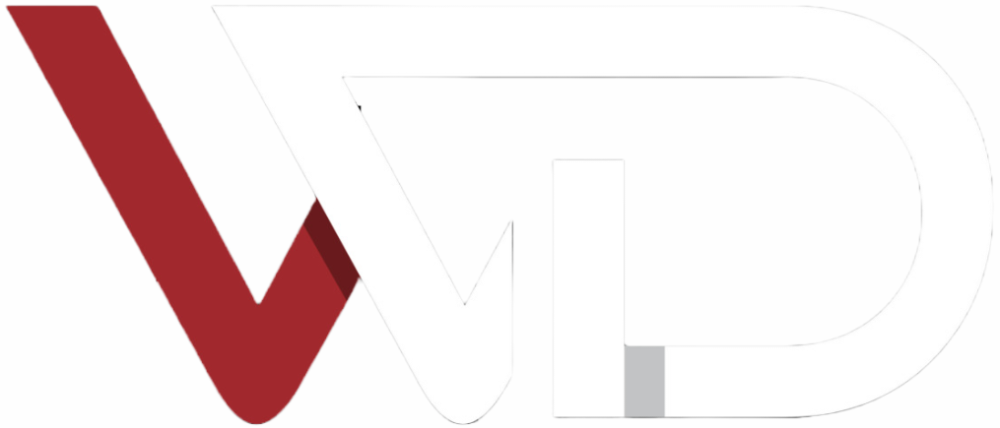

# PROJECT TITLE: WORKOUT DASHBOARD 

#### Video Demo:  <URL [HERE](https://youtu.be/vq3lHtr0gaU?si=-E0lKwQb6xlZkhWN)>

## Project Description

A workout dashboard website is an online platform designed to help users track and manage their fitness routines. It typically includes features such as logging workouts, tracking progress over time, ask AI for more details about their exercises, such as type, duration, and intensity, and receive feedback or recommendations based on their data. The Workout Dashboard Website is an innovative and user-friendly platform designed as part of a CS50 project to assist users in effectively managing and tracking their fitness routines. This online tool provides a centralized space for users to log their workouts, monitor their progress, and receive personalized insights.

- Key Features:

    - Workout Logging:

        - Users can record details of their workouts, including the type of exercise, duration, intensity, and any additional notes.

        - Support for a wide variety of exercises, from cardio and strength training to yoga and sports activities.

    - Progress Tracking:

        - Visual tools such as charts to help users see their progress over time.

    - AI-Powered Exercise Assistant:

        - Suggestions for optimizing workouts based on user data, goals, and fitness level.

        - Personalized feedback and motivation tips to help users stay on track.

    - User-Friendly Interface:

        - An intuitive design that makes navigation seamless, even for users who are not tech-savvy.

    - Technologies Used:

        - Frontend: HTML, CSS, JavaScript.

        - Backend: Python with Flask for server-side operations.

        - Database: SQL (e.g., SQLite) for storing user data.

    - Objectives:

        - Empower users to take charge of their fitness journey through technology.

        - Create a scalable and maintainable platform that can be further developed in the future.

    - Challenges and Learning Outcomes:

        - Implementing secure and efficient user authentication.

        - Managing and visualizing data in a way that’s intuitive and informative.

This project showcases a comprehensive understanding of web development, user-centered design. It’s a reflection of the knowledge and skills gained during the CS50 course, with the potential for real-world impact in the fitness domain.

## Built With

- 
- 
- 
- 

## License

[MIT](https://choosealicense.com/licenses/mit/)

## Contact

Mohammed Hazem - midoeid106@gmail.com

Project Link: [CS50 Project](https://github.com/Mohamedeid106/cs50_project)
